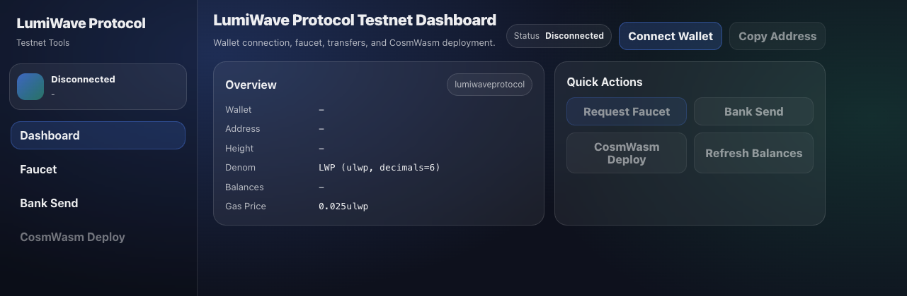

# LumiWave Protocol Testnet Dashboard

Web dashboard for LumiWave testnet operations, built with React + Vite and CosmJS.

It provides one UI for wallet connection, faucet requests, native transfers, CosmWasm deployment, and CW721 NFT mint flow.



## Features

- Wallet connection
  - Keplr: full support
  - Leap: full support
  - Cosmostation: Bank Send only
- Faucet request (GraphQL endpoint, rate-limit aware)
- Bank Send (native token transfer)
- CosmWasm Deploy
  - Store Code (`.wasm` upload)
  - Instantiate contract with custom `initMsg` JSON
- NFT Deploy (CW721)
  - Store Code (`.wasm`)
  - Instantiate collection (`name`, `symbol`, `minter`, optional `admin`)
- NFT Mint (CW721 `mint` execute)
- Native balance view in base/display denom formats

## Requirements

- Node.js 18+
- npm 9+
- Browser wallet extension: Keplr or Leap recommended (Cosmostation is limited in this app)

## Installation

```bash
npm install
```

## Environment Variables

Create `.env` at project root.

```env
VITE_CHAIN_ID=lumiwaveprotocol
VITE_CHAIN_NAME=LumiWave Protocol Testnet

# Endpoints
# RPC: browser-accessible CometBFT JSON-RPC
VITE_RPC=https://lwp-testnet.lumiwavelab.com/tendermint/
# REST: must include trailing slash (used for direct path concatenation)
VITE_REST=https://lwp-testnet.lumiwavelab.com/

# Address / token config
VITE_BECH32_PREFIX=lumi
VITE_DENOM=ulwp
VITE_DENOM_DISPLAY=LWP
VITE_DECIMALS=6
VITE_GAS_PRICE=0.025ulwp

# Faucet GraphQL API base path
# Example: https://your-faucet-host.com/api/faucet
VITE_FAUCET_API=https://lwp-testnet-faucet.lumiwavelab.com/api/faucet
```

Notes:
- `VITE_FAUCET_API` is the value actually used for faucet requests.
- Wallet chain suggestion uses the above chain/token fields directly, so set all of them.

## Run

```bash
npm run dev
```

Local URL: `http://localhost:5173`

## Scripts

```bash
npm run dev      # start dev server
npm run start    # same as dev
npm run build    # production build
npm run preview  # preview built app
npm run lint     # eslint
```

## Usage

### 1) Connect Wallet

1. Click `Connect Wallet`
2. Select Keplr / Leap / Cosmostation
3. On success, address, block height, and balances appear in Dashboard

Cosmostation policy in this app:
- `Bank Send`: supported
- `CosmWasm Deploy`, `NFT Deploy`, `NFT Mint`: disabled

### 2) Faucet

1. Open `Faucet`
2. Click `Request Faucet`
3. If rate-limited, the UI shows a friendly message (`429` handling)

### 3) Bank Send

1. Enter recipient bech32 address (e.g. `lumi1...`)
2. Enter amount in display denom (e.g. `LWP`)
3. Optional memo
4. Submit and approve in wallet

Amount is converted to base denom using `VITE_DECIMALS`.

### 4) CosmWasm Deploy

1. Upload compiled `.wasm`
2. Click `Store Code` to get `codeId`
3. Fill `codeId`, `label`, optional `admin`, `initMsg` JSON
4. Click `Instantiate`

You can deploy CW20 or any compatible CosmWasm contract by providing correct `initMsg`.

### 5) NFT Deploy (CW721)

1. Upload CW721 `.wasm`
2. `Store Code`
3. Fill `codeId`, `collectionName`, `symbol`, optional `minter` / `admin`
4. Click `Deploy Collection`

### 6) NFT Mint

1. Enter CW721 collection contract address
2. Enter `tokenId`
3. Optional `recipient` and `tokenUri`
4. Click `Mint NFT`

## Example CW20 `initMsg`

```json
{
  "name": "LumiWave Token",
  "symbol": "LWT",
  "decimals": 6,
  "initial_balances": [
    {
      "address": "lumi1...",
      "amount": "1000000000"
    }
  ],
  "mint": {
    "minter": "lumi1...",
    "cap": "1000000000000"
  }
}
```

## Current Scope / Limitations

- Native balance refresh is implemented.
- CW20/NFT auto-discovery and aggregated balance panels are scaffolded but not fully wired yet.
- Only compiled `.wasm` binaries are accepted for Store Code.

## Project Structure

```text
src/
  App.jsx
  main.jsx
  App.css
  index.css
  keplr.js
  wallets.js
  config/
    constants.js
  components/
    layout/
      Sidebar.jsx
      TopBar.jsx
    wallet/
      WalletModal.jsx
    dashboard/
      Overview.jsx
      QuickActions.jsx
    faucet/
      FaucetSection.jsx
    bank/
      BankSendSection.jsx
    wasm/
      WasmDeploySection.jsx
    nft/
      NFTDeploySection.jsx
      NFTMintSection.jsx
  hooks/
    useWallet.js
    useAllBalances.js
    useFaucet.js
    useBankSend.js
    useWasmDeploy.js
    useCW721Deploy.js
    useNFTMint.js
  services/
    walletService.js
    balanceService.js
    faucetService.js
    bankService.js
    wasmService.js
    cw20Service.js
    cw721Service.js
  utils/
    formatters.js
```

## Troubleshooting

- Faucet `429`: expected rate-limit behavior from server policy.
- Wallet connection fails:
  - verify extension is installed/unlocked
  - ensure `VITE_RPC` is reachable in browser
  - ensure chain/token env values are correctly set
- Balance fetch fails:
  - ensure `VITE_REST` includes trailing slash

## License

MIT
