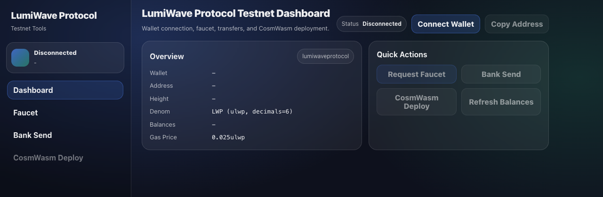

# LumiWave Protocol Dashboard

Web dashboard for LumiWave Protocol operations, built with React + Vite and CosmJS. Supports both **Testnet** and **Mainnet** with in-app network switching.

It provides one UI for wallet connection, faucet requests, native transfers, tokenfactory native coin deployment, CosmWasm deployment, and CW721 NFT mint flow.



## Features

- **Testnet / Mainnet switching**
  - In-app network selector (sidebar dropdown)
  - Wallet auto-disconnects on network switch to prevent stale connections
  - Selected network persisted in localStorage
  - Faucet is hidden on Mainnet
- Wallet connection
  - Keplr: full support
  - Leap: full support
  - Cosmostation: Bank Send only
  - Auto chain registration via `experimentalSuggestChain`
- Faucet request (GraphQL endpoint, rate-limit aware) - Testnet only
- Bank Send (native token transfer)
- Token Factory (native coin deployment)
  - Create denom (`MsgCreateDenom`)
  - Mint supply (`MsgMint`)
  - Set metadata (`MsgSetDenomMetadata`)
- CosmWasm Deploy
  - Store Code (`.wasm` upload)
  - Instantiate contract with custom `initMsg` JSON
- NFT Deploy (CW721)
  - Store Code (`.wasm`)
  - Instantiate collection (`name`, `symbol`, `minter`, optional `admin`)
- NFT Mint (CW721 `mint` execute)
- Native balance view in base/display denom formats

## Requirements

- Node.js 18+
- npm 9+
- Browser wallet extension: Keplr or Leap recommended (Cosmostation is limited in this app)

## Installation

```bash
npm install
```

## Network Endpoints

The dashboard has built-in network configurations for both Testnet and Mainnet. Users can switch between them using the dropdown in the sidebar.

| | Testnet | Mainnet |
|---|---|---|
| RPC | `https://lwp-testnet.lumiwavelab.com/tendermint/` | `https://lwp-mainnet-rpc.lumiwavelab.com` |
| REST/API | `https://lwp-testnet.lumiwavelab.com/` | `https://lwp-mainnet-api.lumiwavelab.com` |
| gRPC | - | `lwp-mainnet-grpc.lumiwavelab.com` (SSL) |
| Faucet | Available | Not available |

Network configurations are defined in `src/config/networks.js`. The `.env` file is used for testnet defaults and faucet proxy settings.

## Environment Variables

Create `.env` as baseline config, use `.env.local` for local overrides in `npm run dev`, and use `.env.production` for production build.

Priority in dev mode:
- `.env.local` (highest, local-only)
- `.env`

### Local Development (`.env`)

```env
VITE_CHAIN_ID=lumiwaveprotocol-testnet
VITE_CHAIN_NAME=LumiWave Protocol Testnet

# Endpoints (used as testnet defaults)
# RPC: browser-accessible CometBFT JSON-RPC
VITE_RPC=https://lwp-testnet.lumiwavelab.com/tendermint/
# REST: must include trailing slash (used for direct path concatenation)
VITE_REST=https://lwp-testnet.lumiwavelab.com/

# Address / token config
VITE_BECH32_PREFIX=lumi
VITE_DENOM=ulwp
VITE_DENOM_DISPLAY=LWP
VITE_DECIMALS=6
VITE_GAS_PRICE=0.025ulwp
VITE_TOKENFACTORY_CREATE_DENOM_TYPE_URL=/osmosis.tokenfactory.v1beta1.MsgCreateDenom
VITE_TOKENFACTORY_MINT_TYPE_URL=/osmosis.tokenfactory.v1beta1.MsgMint
VITE_TOKENFACTORY_SET_METADATA_TYPE_URL=/osmosis.tokenfactory.v1beta1.MsgSetDenomMetadata
VITE_TOKENFACTORY_SET_METADATA_GAS_MULTIPLIER=1.8

# Faucet via Vite proxy (testnet only)
VITE_FAUCET_API=/api/faucet
```

### Production (`.env.production`) Example

```env
VITE_CHAIN_ID=lumiwaveprotocol-testnet
VITE_CHAIN_NAME=LumiWave Protocol Testnet
VITE_RPC=https://lwp-testnet.lumiwavelab.com/tendermint/
VITE_REST=https://lwp-testnet.lumiwavelab.com/
VITE_BECH32_PREFIX=lumi
VITE_DENOM=ulwp
VITE_DENOM_DISPLAY=LWP
VITE_DECIMALS=6
VITE_GAS_PRICE=0.025ulwp
VITE_TOKENFACTORY_CREATE_DENOM_TYPE_URL=/osmosis.tokenfactory.v1beta1.MsgCreateDenom
VITE_TOKENFACTORY_MINT_TYPE_URL=/osmosis.tokenfactory.v1beta1.MsgMint
VITE_TOKENFACTORY_SET_METADATA_TYPE_URL=/osmosis.tokenfactory.v1beta1.MsgSetDenomMetadata
VITE_TOKENFACTORY_SET_METADATA_GAS_MULTIPLIER=1.8
VITE_FAUCET_API=/api/faucet/
```

Notes:
- `.env` values are used as testnet defaults. Mainnet endpoints are hardcoded in `src/config/networks.js`.
- `VITE_FAUCET_API` is the value actually used for faucet requests (testnet only).
- Wallet chain suggestion uses the above chain/token fields directly, so set all of them.
- Keep trailing slash for `VITE_REST`.
- `VITE_FAUCET_API` can be absolute URL or relative path.
- `vite.config.js` proxy can be overridden by `VITE_FAUCET_PROXY_PATH`, `VITE_FAUCET_PROXY_TARGET`, `VITE_FAUCET_PROXY_REWRITE`.
- If mainnet tokenfactory protobuf package differs, update `MAINNET_CONFIG` in `src/config/networks.js`.

### Faucet Configuration Modes

- Dev mode (recommended): use `VITE_FAUCET_API=/api/faucet` and Vite proxy in `vite.config.js`.
- Prod mode:
  - Option A: serve API under same origin (`/api/faucet`) using reverse proxy.
  - Option B: set `VITE_FAUCET_API` to absolute faucet endpoint.

## Run

```bash
npm run dev
```

Local URL: `http://localhost:5173`

## Scripts

```bash
npm run dev      # start dev server
npm run start    # same as dev
npm run build    # production build
npm run preview  # preview built app
npm run lint     # eslint
```

## Wallet Support Matrix

| Wallet | Connect | Faucet | Bank Send | CosmWasm Deploy | NFT Deploy/Mint |
|---|---|---|---|---|---|
| Keplr | Yes | Yes | Yes | Yes | Yes |
| Leap | Yes | Yes | Yes | Yes | Yes |
| Cosmostation | Yes | Yes | Yes | No | No |

Tokenfactory uses Stargate transaction signing and is available for all wallets in this app.

## Usage

### 1) Switch Network

1. Use the dropdown in the sidebar to select **Testnet** or **Mainnet**
2. Wallet disconnects automatically on switch
3. Selected network is saved and persisted across page reloads
4. Faucet is only available on Testnet

### 2) Connect Wallet

1. Click `Connect Wallet`
2. Select Keplr / Leap / Cosmostation
3. The chain is auto-registered in your wallet via `experimentalSuggestChain`
4. On success, address, block height, and balances appear in Dashboard

Cosmostation policy in this app:
- `Bank Send`: supported
- `Token Factory`: supported
- `CosmWasm Deploy`, `NFT Deploy`, `NFT Mint`: disabled

### 3) Faucet (Testnet only)

1. Open `Faucet`
2. Click `Request Faucet`
3. If rate-limited, the UI shows a friendly message (`429` handling)

### 4) Bank Send

1. Enter recipient bech32 address (e.g. `lumi1...`)
2. Enter amount in display denom (e.g. `LWP`)
3. Optional memo
4. Submit and approve in wallet

Amount is converted to base denom using `VITE_DECIMALS`.

### 5) CosmWasm Deploy

1. Upload compiled `.wasm`
2. Click `Store Code` to get `codeId`
3. Fill `codeId`, `label`, optional `admin`, `initMsg` JSON
4. Click `Instantiate`

You can deploy CW20 or any compatible CosmWasm contract by providing correct `initMsg`.

### 6) Token Factory (New Native Coin)

1. Open `Token Factory`
2. Enter `subdenom` and click `Create Denom`
3. Confirm the created denom (typically `factory/{creator}/{subdenom}`)
4. Enter amount and recipient, then click `Mint`
5. Set `Display/Symbol/Decimals` and click `Set Metadata` (for wallet display)

Amount is entered in display denom and converted to base units using `VITE_DECIMALS`.

### 7) NFT Deploy (CW721)

1. Upload CW721 `.wasm`
2. `Store Code`
3. Fill `codeId`, `collectionName`, `symbol`, optional `minter` / `admin`
4. Click `Deploy Collection`

### 8) NFT Mint

1. Enter CW721 collection contract address
2. Enter `tokenId`
3. Optional `recipient` and `tokenUri`
4. Click `Mint NFT`

## Example CW20 `initMsg`

```json
{
  "name": "LumiWave Token",
  "symbol": "LWT",
  "decimals": 6,
  "initial_balances": [
    {
      "address": "lumi1...",
      "amount": "1000000000"
    }
  ],
  "mint": {
    "minter": "lumi1...",
    "cap": "1000000000000"
  }
}
```

## Current Scope / Limitations

- Native balance refresh is implemented.
- CW20/NFT auto-discovery and aggregated balance panels are scaffolded but not fully wired yet.
- Only compiled `.wasm` binaries are accepted for Store Code.

## Deployment

1. Build:

```bash
npm run build
```

2. Deploy `dist/` to static hosting (Nginx, S3+CloudFront, Vercel, etc.).
3. If using relative faucet path (`/api/faucet`), configure reverse proxy in the hosting layer.

## Production Checklist

- `VITE_CHAIN_ID`, denom, decimals, bech32 prefix are correct for target chain.
- `VITE_TOKENFACTORY_CREATE_DENOM_TYPE_URL`, `VITE_TOKENFACTORY_MINT_TYPE_URL`, `VITE_TOKENFACTORY_SET_METADATA_TYPE_URL` match your chain protobuf package.
- `VITE_RPC` and `VITE_REST` are browser-accessible.
- `VITE_REST` includes trailing slash.
- Faucet endpoint/proxy is reachable from browser origin.
- Wallet extension flow (connect/send/store/instantiate) is validated once on target environment.
- Mainnet endpoints in `src/config/networks.js` are correct and accessible.

## Project Structure

```text
src/
  App.jsx
  main.jsx
  App.css
  index.css
  keplr.js
  wallets.js
  config/
    constants.js
    networks.js          # Testnet/Mainnet endpoint definitions
    NetworkContext.jsx    # React Context for network switching
  components/
    layout/
      Sidebar.jsx
      TopBar.jsx
    wallet/
      WalletModal.jsx
    dashboard/
      Overview.jsx
      QuickActions.jsx
    faucet/
      FaucetSection.jsx
    bank/
      BankSendSection.jsx
    tokenfactory/
      TokenFactorySection.jsx
    wasm/
      WasmDeploySection.jsx
    nft/
      NFTDeploySection.jsx
      NFTMintSection.jsx
  hooks/
    useWallet.js
    useAllBalances.js
    useFaucet.js
    useBankSend.js
    useTokenFactory.js
    useWasmDeploy.js
    useCW721Deploy.js
    useNFTMint.js
  services/
    walletService.js
    balanceService.js
    faucetService.js
    bankService.js
    tokenFactoryService.js
    tokenFactoryTypes.js
    wasmService.js
    cw20Service.js
    cw721Service.js
  utils/
    formatters.js
```

## Troubleshooting

- Faucet `429`: expected rate-limit behavior from server policy.
- Faucet not visible: Faucet is only available on Testnet. Switch network in the sidebar.
- Wallet connection fails:
  - verify extension is installed/unlocked
  - ensure RPC endpoint is reachable in browser
  - ensure chain/token env values are correctly set
- Balance fetch fails:
  - ensure REST endpoint includes trailing slash (testnet) or is accessible (mainnet)
- Network switch issues:
  - wallet disconnects automatically on switch; reconnect after switching
  - Testnet and Mainnet share the same `chainId`; the wallet may show the name from whichever was registered first

## License

MIT
